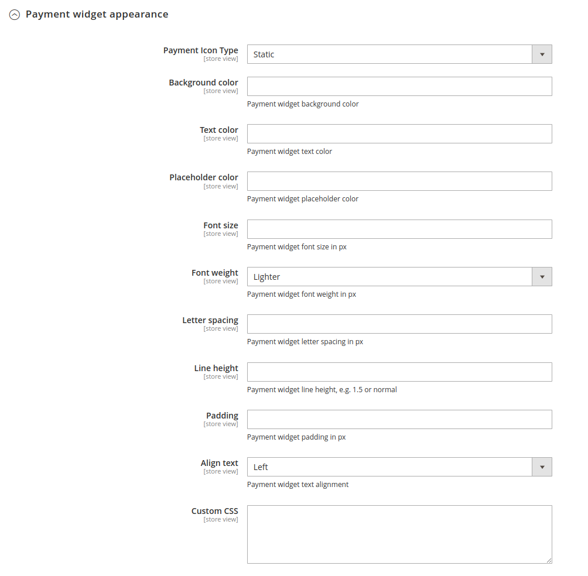

# Payoneer Magento 2 Integration Extension with [Payoneer Checkout](https://checkoutdocs.payoneer.com/)

This library includes the files of the Magento 2 Extension for Payoneer Checkout or Open Payment Gateway (OPG). The directories hierarchy is as positioned in a standard magento 2 project library.

## Version

Payoneer Magento Extension version: 0.8

## Release Notes

### 0.8 - 2023-09-26

 - Compatability with Magento 2.4.6
 - Add MoR (Merchant on Record) features

### 0.7 - 2022-11-18
 - 
 - Send system information in list session call

### 0.6 - 2022-11-01

- Fixed issue with locale sent to PSP list session
- Updated documentation

### 0.5 - 2022-09-30

- Compatibility with Magento 2.4.5
- Fixed issue with mini cart in case of failed transactions.
- Update list session for already existing sessions.
- Create new payment list session if the update session fails.
- Fixed issue with transaction page for captured orders.
- New Feature to display static payment icons.
- Handle notifications from Payoneer immediately.
- Compatibility with Magento 2.4.0
- Fixed issue with invoice of cancelled orders.
- Localization in Simplified and Traditional Chinese.
- Fixed issue with partial refund.

## Requirements

Magento versions 2.4.0 - 2.4.6

PHP versions 7.3, 7.4, 8.1

## Install via [composer](https://getcomposer.org/download/)

Run the following command under your Magento 2 root dir:

```cmd
composer require payoneer/open-payment-gateway
php bin/magento maintenance:enable
php bin/magento setup:upgrade
php bin/magento setup:di:compile
php bin/magento setup:static-content:deploy
php bin/magento maintenance:disable
php bin/magento cache:clean
```

## Install manually under app/code

1. Download and place the contents of this repository under {YOUR-MAGENTO-ROOT-DIR}/app/code/Payoneer/OpenPaymentGateway.
2. Run the following commands under your Magento 2 root dir:

```cmd
php bin/magento maintenance:enable
php bin/magento module:enable Payoneer_OpenPaymentGateway
php bin/magento setup:upgrade
php bin/magento setup:di:compile
php bin/magento setup:static-content:deploy
php bin/magento maintenance:disable
php bin/magento cache:clean
```

## Usage

After the installation, Go to the Magento 2 admin panel

Go to Stores -> Settings -> Configuration -> Sales -> Payment Methods -> Other Payment Methods -> Payoneer Checkout


Enable the payment gateway and choose whether it's Test environment or Live. Provide the corresponding merchant code and API key. If your Merchant account doesn't have a default Store code against it, provide it here.

## Advanced Configuration


You can set advanced configurations here.

## Style Configuration



You can set the style of the embedded widget from here. Please note that, styles defined in the field Custom CSS will override any conflicting configurations as per CSS specificity rules.
