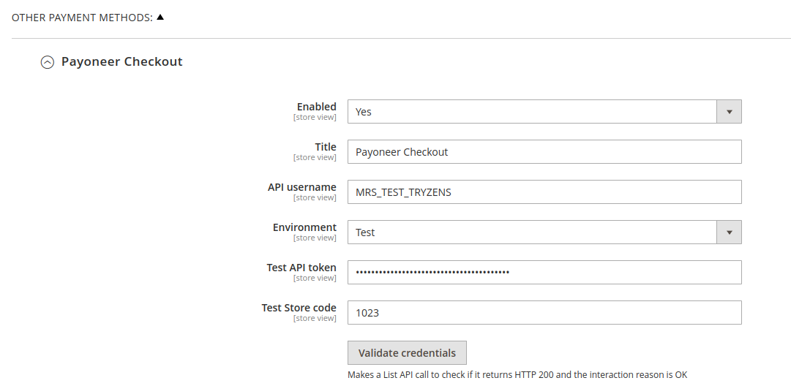

# Payoneer Magento 2 Integration Extension with [Open Payment Gateway](https://www.optile.io/opg)

This library includes the files of the Magento 2 Extension for Payoneer Payment Gateway or Open Payment Gateway (OPG). The directories hierarchy is as positioned in a standard magento 2 project library.

## Requirements

Magento 2.4+ (Module version 1.0.0)

## Install via [composer](https://getcomposer.org/download/) (recommended)

Run the following command under your Magento 2 root dir:

```cmd
composer require payoneer/open-payment-gateway
php bin/magento maintenance:enable
php bin/magento setup:upgrade
php bin/magento setup:di:compile
php bin/magento setup:static-content:deploy
php bin/magento maintenance:disable
php bin/magento cache:clean
```

## Install manually under app/code

1. Download and place the contents of this repository under {YOUR-MAGENTO-ROOT-DIR}/app/code/Payoneer/OpenPaymentGateway.
2. Run the following commands under your Magento 2 root dir:

```cmd
php bin/magento maintenance:enable
php bin/magento module:enable Payoneer_OpenPaymentGateway
php bin/magento setup:upgrade
php bin/magento setup:di:compile
php bin/magento setup:static-content:deploy
php bin/magento maintenance:disable
php bin/magento cache:clean
```

## Usage

After the installation, Go to the Magento 2 admin panel

Go to Stores -> Settings -> Configuration -> Sales -> Payment Methods -> Other Payment Methods -> Payoneer Payment Gateway



Enable the payment gateway and choose whether it's Test environment or Live. Provide the corresponding merchant code and API key. If your Merchant account doesn't have a default Store code against it, provide it here.

## Advanced Configuration


You can set advanced configurations here.

## Style Configuration


You can set the style of the embedded widget from here. Please note that, styles defined in the field Checkout CSS will override any conflicting configurations as per CSS specificity rules.
